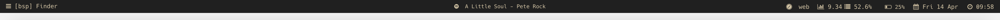

# Bar

My take on a [Übersicht](http://tracesof.net/uebersicht/) system information bar for use with [Kwm](https://github.com/koekeishiya/kwm) window manager.
Forked from  [koekeishiya](https://github.com/koekeishiya/nerdbar.widget).



## Installation

Make sure you have [Übersicht](http://tracesof.net/uebersicht/) installed.

Then clone this repository.

```bash
git clone git@github.com:antoniocapelo/nerdbar.widget.git $HOME/Library/Application\ Support/Übersicht/widgets
```
